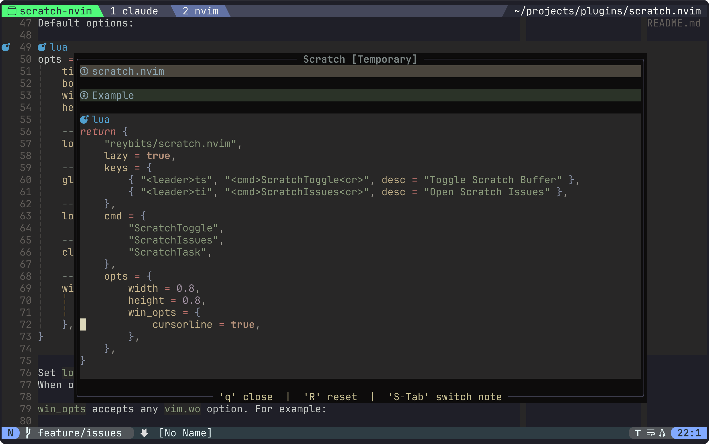
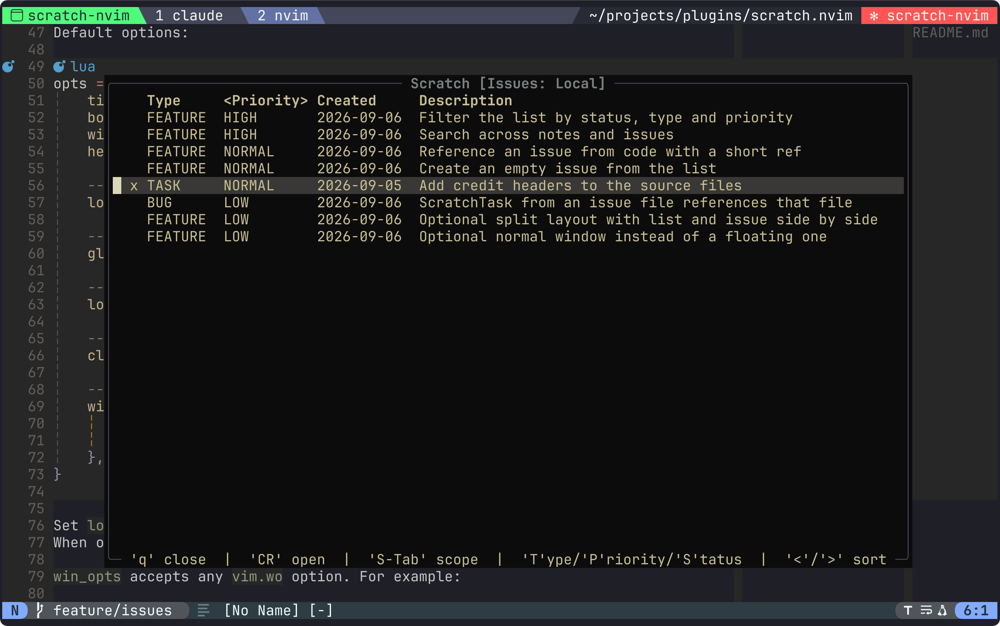

# Neovim Scratch Buffer

A Neovim plugin that keeps notes and small issues in one floating window,
a keystroke away from whatever you are working on.

Notes come in three scopes: temporary (in-memory), local (per-project) and
global (shared across projects); `S-Tab` cycles them. Issues are one markdown
file each, carrying a few metadata fields, shown as a sortable list in the
same window and opened in place of a note.

Everything the window shows is an ordinary buffer, and everything with a file
behind it is an ordinary file buffer — so `:w`, undo, `C-o`/`C-i` and the
cursor position behave exactly as they do anywhere else in Neovim.



*A temporary note. The footer names the keys the current buffer answers to.*



*The issue list, ordered by priority. The active order marks its own column,
and a closed issue keeps a checkbox-style mark.*

## Features

- Floating scratch window with markdown and Treesitter highlighting.
- **Temporary notes** — in-memory, never written to disk.
- **Local notes** — persisted per-project (`.scratch/note.md` at the git root).
- **Global notes** — persisted across projects (`stdpath("data")/scratch.nvim/note.md`).
- Cycle between note types with `S-Tab`.
- A note is an ordinary markdown file buffer, so writing, undo, reloading and
  the cursor position are Neovim's own. Its file appears the first time there
  is something to write, so a note you never touched leaves nothing on disk.
- **Issues** — one markdown file per issue, local to a project or global,
  listed in the same window and opened as ordinary file buffers. Every project
  has a list of its own, remembering the row you left it on.
- Type, priority and status are changed straight from the list; the list is
  ordered by any of its columns, and priority is colour-coded.
- Nothing of the plugin's own ends up in the buffer list, and a file that
  belongs to neither notes nor issues is never left inside the window.
- Notes and issues are written whenever they leave the screen, so nothing is
  lost by jumping away or closing the window. Closing it also lets those
  buffers go, and they come back from their files where you left them.
- Configurable window size, border, title, and behavior.

## Breaking changes

### 0.2.0 — one directory per scope

A note and the issues of the same scope now live side by side, so each scope
is a single directory instead of a file next to a directory:

| | before | after |
|---|---|---|
| local note | `<git root>/.scratch.md` | `<git root>/.scratch/note.md` |
| local issues | `<git root>/.scratch/issues/` | unchanged |
| global note | `stdpath("data")/scratch.nvim/global.md` | `stdpath("data")/scratch.nvim/note.md` |
| global issues | `stdpath("data")/scratch.nvim/issues/` | unchanged |

`local_notes_file` is gone; `local_dir` names the per-project directory
instead, and it holds both the note and the issues.

**Move your notes once.** The plugin does not do it for you: it simply looks
in the new place, and an old file is left where it is.

```bash
# in each project that has one
mkdir -p .scratch && mv .scratch.md .scratch/note.md

# once, for the global note
cd "${XDG_DATA_HOME:-$HOME/.local/share}/nvim/scratch.nvim" && mv global.md note.md
```

One line covers everything in `.gitignore` now:

```gitignore
/.scratch/
```

## Installation

### [Lazy](https://github.com/folke/lazy.nvim)

```lua
{
    "reybits/scratch.nvim",
    lazy = true,
    keys = {
        { "<leader>ts", "<cmd>ScratchToggle<cr>", desc = "Toggle Scratch Buffer" },
        { "<leader>ti", "<cmd>ScratchIssues<cr>", desc = "Toggle Scratch Issues" },
        { "<leader>tt", "<cmd>ScratchTask<cr>", desc = "New Scratch Task" },
    },
    cmd = {
        "ScratchToggle",
        "ScratchIssues",
        "ScratchTask",
    },
    opts = {},
}
```

## Configuration

Default options:

```lua
opts = {
    title = "Scratch",
    border = "rounded",
    width = 0.6,
    height = 0.6,

    -- enable per-project notes
    local_notes = true,

    -- enable global notes
    global_notes = true,

    -- per-project directory holding the note and the issues
    local_dir = ".scratch",

    -- close the window when the focus leaves it
    close_on_leave = true,

    -- window-local options (vim.wo)
    win_opts = {
        wrap = true,
        linebreak = true,
        cursorline = true,
    },
}
```

Set `local_notes = false` or `global_notes = false` to disable a note type.
When only one type is enabled, the type label and switch keymaps are hidden.

`win_opts` accepts any `vim.wo` option and applies to every buffer the window
shows, the issue list included, which is why `cursorline` is on by default —
a list is hard to read without the current row standing out. For example:

```lua
opts = {
    win_opts = {
        wrap = true,
        linebreak = true,
        cursorline = true,
        number = true,
    },
}
```

## Usage

### Commands

- `:ScratchToggle` — Show the note in the scratch window, or close the window
  if the note is already in front.
- `:ScratchIssues` — Same for the issue list. Either command swaps the window
  to what it names, so `:ScratchIssues` on an open note shows the list rather
  than closing anything.
- `:ScratchTask [title]` — Create an issue in the current project and open it.
  With `!` the issue goes to the global scope instead. Without a title, one is
  asked for.

### Keymaps (inside the scratch window)

| Key       | Action                        |
|-----------|-------------------------------|
| `q`       | Close the scratch window      |
| `R`       | Reset (clear) the current note|
| `S-Tab`   | Switch to next note type      |

### Keymaps (inside the issue list)

| Key       | Action                        |
|-----------|-------------------------------|
| `q`       | Close the scratch window      |
| `CR`      | Open the issue under the cursor|
| `S-Tab`   | Switch between local and global|
| `T`       | Cycle type: bug, feature, refactor, task|
| `P`       | Cycle priority: low, normal, high, critical|
| `S`       | Toggle status: open, done     |
| `>` / `<` | Next / previous sort order    |

`Tab` is deliberately left alone: it is the same keycode as `C-i`, and mapping
it would break jumping forward through the jumplist.

Notes and issues alike are ordinary file buffers, so `:w`, undo, `C-o`/`C-i`
and the cursor position behave as they do anywhere else — the plugin keeps no
positions of its own. Its buffers stay out of the buffer list, and everything
it owns follows one rule: **a buffer is written when it stops being visible** —
left with `C-o`, swapped out of the window, or closed with it — plus a final
write when nvim quits. Buffers that have a file live no longer than the window:
closing it writes them and lets them go, so they neither pile up nor stand
between you and `:q`, and reopening reads them back where you were. The
temporary note is the exception, because it exists nowhere but in its buffer:
it stays for the session, undo history and all.

Two Neovim instances sharing a note behave the way two instances sharing any
file do — the one that writes second is told the file changed underneath it.

A jump can also land on a file that has nothing to do with notes or issues
(`gF` from an issue into the code, `C-o` further back, `gd`). Such a file is
never left inside the floating window: it is handed to a normal window, and
the scratch window closes.

### Lua API

- `require('scratch').toggle()` — Toggle the scratch window.
- `require('scratch').close()` — Close the scratch window.
- `require('scratch').reset()` — Clear the current note buffer.
- `require('scratch').next_type()` — Switch to the next note type.
- `require('scratch').prev_type()` — Switch to the previous note type.
- `require('scratch').issues()` — Toggle the issue list.
- `require('scratch').task(scope, title)` — Create an issue in `"local"` or
  `"global"` scope.
- `require('scratch').open_issue(path)` — Show an issue file in the window.

`reset()` clears the note that is **on screen**, and `next_type()` /
`prev_type()` step away from it — the plugin always works with the buffer the
window holds, never with a remembered selection.

## Issues

Every issue is one markdown file, kept beside the note of the same scope:
`.scratch/issues/` at the git root, or `stdpath("data")/scratch.nvim/issues/`
for the global scope. The file name is the creation time, so the store needs
no counter and the directory sorts chronologically on its own.

```markdown
---
type: bug
priority: high
status: open
---

# Parser drops the last line of a file

src/parser.c:412

Free-form markdown below the title.
```

- `type` — `bug`, `feature`, `refactor` or `task`
- `priority` — `low`, `normal`, `high` or `critical`
- `status` — `open` or `done`

Only these fields and the first `#` heading are read; everything else in the
file is left alone. Missing fields fall back to `task`, `normal` and `open`,
so a file written by hand still shows up in the list. Fields can be changed
from the list with `T`, `P` and `S`, which rewrite that one frontmatter line
and leave the rest of the file alone, or by editing the file by hand.

Such a change repaints only its own row. The filter is applied when the list
is built, not while you are working in it, so closing an issue leaves it in
place with its mark, and it disappears the next time the list is entered — a
key never lands on a different issue than the one under the cursor.

The list shows open issues, newest first, with a checkbox-style mark for
closed ones. Sorting and filtering are properties of the view and never
rewrite the files. Each issue directory has a list of its own — the local
issues of one project are never those of another — so reopening a list puts
you back on the row you left; it starts on the first issue only the first
time.

`>` and `<` walk the sort orders in the order the columns appear: `type` (bugs
first), `priority` (critical first), `created`, `updated`, `title`. The order
in effect is shown in the header itself, wrapped in the same angle brackets as
the keys that move it:

```text
    Type     <Priority> Created     Description
  x TASK     NORMAL     2026-09-05  Update the build image
```

The date column shows whichever date the list is ordered by, so `<Updated>`
carries the last change and `<Created>` the creation time. Every order falls
back to the creation date among equals, so rows keep a stable position instead
of shuffling on each repaint, and the cursor follows its issue through the
reordering rather than staying on the same row.

`updated` is the file's mtime, which git does not preserve: in a fresh clone
every file carries the time of the clone, and `checkout` stamps the files it
touches. For issues kept out of version control it is exact.

### Highlighting

The list carries one colour axis, and it is priority: the type is already
legible as a word, while `HIGH` and `LOW` read alike until they differ in
colour. Everything unimportant is dimmed rather than coloured, so there is one
thing to follow instead of two competing ones.

| Group | Applies to | Links to by default |
|---|---|---|
| `ScratchIssuesHeader` | the column header | bold |
| `ScratchIssueCritical` | priority `critical` | `DiagnosticError` |
| `ScratchIssueHigh` | priority `high` | `DiagnosticWarn` |
| `ScratchIssueLow` | priority `low` | `Comment` |
| `ScratchIssueDate` | the date column | `Comment` |
| `ScratchIssueDone` | a closed issue, whole row | `Comment` |

Priority `normal` is deliberately left plain. All groups are defined with
`default = true`, so any definition of your own wins:

```lua
vim.api.nvim_set_hl(0, "ScratchIssuesHeader", { link = "Title" })
vim.api.nvim_set_hl(0, "ScratchIssueCritical", { fg = "#ff5555", bold = true })
```

A path with a line number, like `src/parser.c:412`, is what `gF` already
understands, so it doubles as a jump back into the code.

`:ScratchTask` reads the line under the cursor: if it is a todo comment, its
keyword sets the type (`BUG`, `FIXME`, `ISSUE` give `bug`; `HACK` gives
`refactor`; `TODO`, `PERF` give `task`) and its text seeds the title. The
location of the cursor is written into the body. The scoped form `BUG(ref):` is recognised as well; note
that [todo-comments.nvim](https://github.com/folke/todo-comments.nvim) does not
highlight that form with its default `search.pattern` and `highlight.pattern`.

## License

[MIT License](LICENSE)

## Contributing

Contributions are welcome! Feel free to open issues or submit pull requests.
